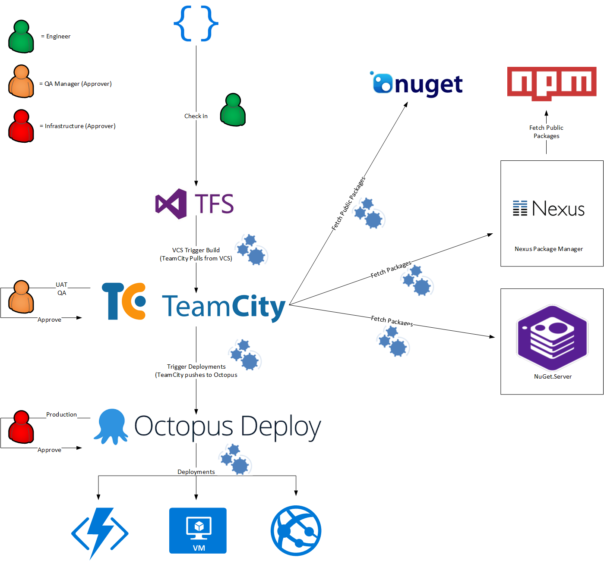

## CI / CD Infrastructure

### High Level Architecture

To edit the above diagram, please use this [Visio file](https://github.com/ghostinthewires/Team-Handbook-Template/tree/master/Team-Handbook-Template/engineering/infrastructure/assets/ci-cd-infrastructure.vsdx). Once edited this should be commited back to the repo using the standard process. The image here should also be updated, this image should be generated using this [script](https://github.com/ghostinthewires/Team-Handbook-Template/tree/master/Team-Handbook-Template/engineering/infrastructure/assets/VisiotoPNG.ps1).

### Logical Architecture

To edit the above diagram, please use this [Visio file](https://github.com/ghostinthewires/Team-Handbook-Template/tree/master/Team-Handbook-Template/engineering/infrastructure/assets/ci-cd-logical.vsdx). Once edited this should be commited back to the repo using the standard process. The image here should also be updated, this image should be generated using this [script](https://github.com/ghostinthewires/Team-Handbook-Template/tree/master/Team-Handbook-Template/engineering/infrastructure/assets/VisiotoPNG.ps1).
